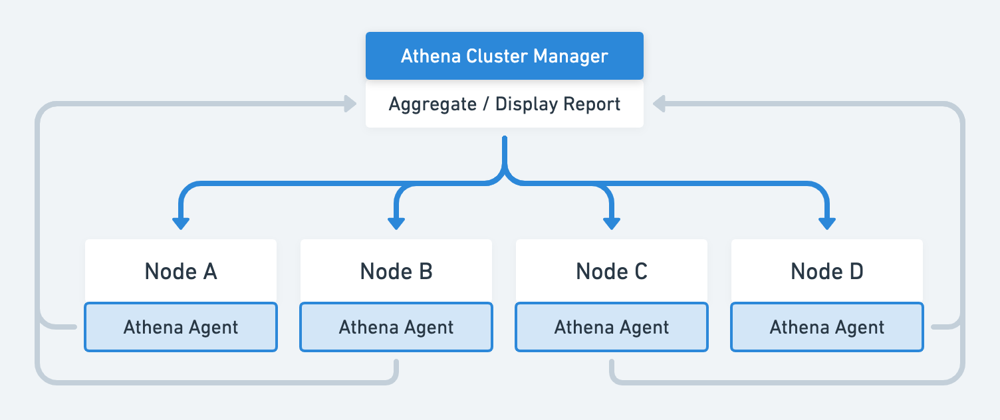
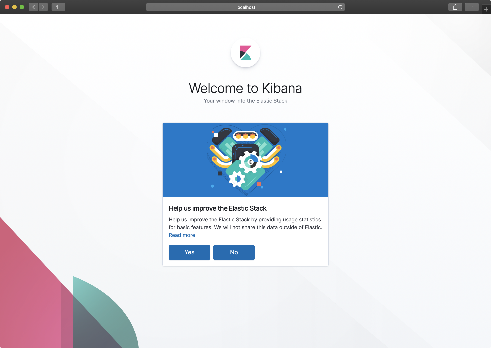
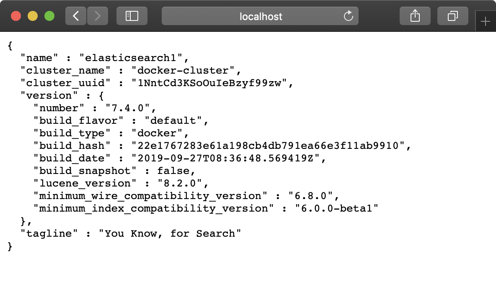
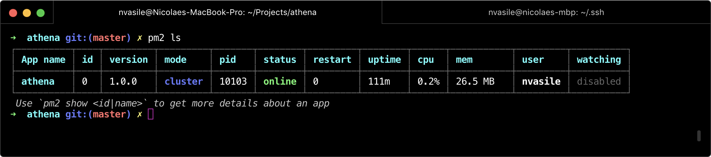
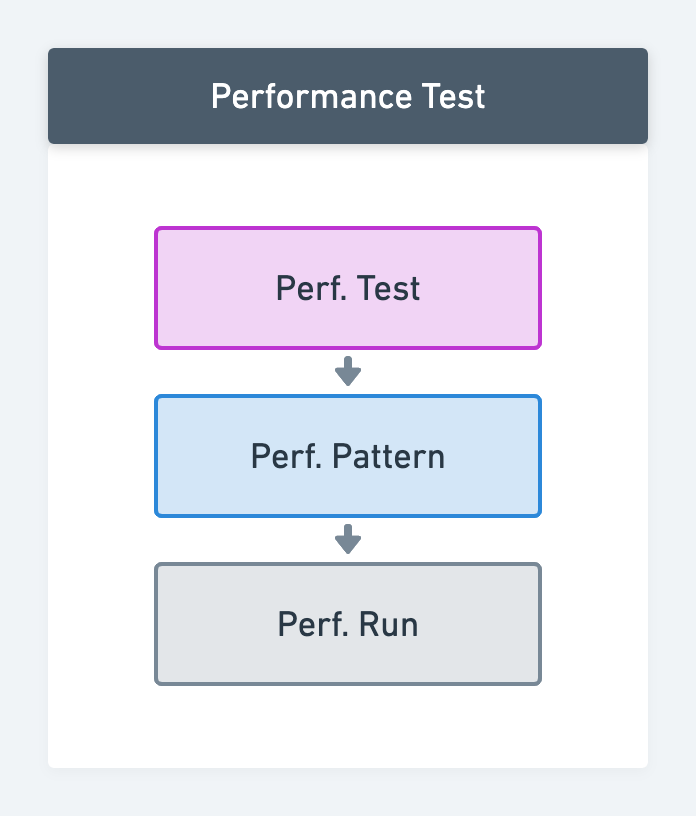
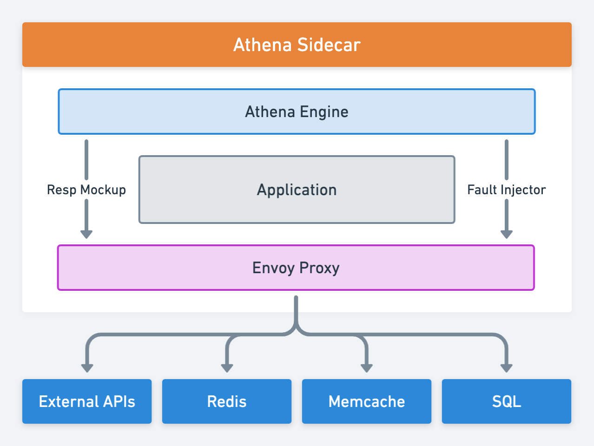

<div style="margin-bottom: -10px">
<p align="center" style="margin: 0 !important;">
  
</p>
</div>

<p align="center">A Performance and Functional Testing Engine for APIs</p>

<p align="center">
  
</p>


<!-- @import "[TOC]" {cmd="toc" depthFrom=1 depthTo=6 orderedList=false} -->

<!-- code_chunk_output -->

- [About](#about)
  - [What can Athena do?](#what-can-athena-do)
  - [How it Works](#how-it-works)
  - [Getting Started](#getting-started)
- [Cluster Support](#cluster-support)
  - [Creating a new Cluster](#creating-a-new-cluster)
    - [Standalone](#standalone)
    - [Docker Compose](#docker-compose)
    - [Accessing Kibana and Elasticsearch](#accessing-kibana-and-elasticsearch)
  - [Process Management](#process-management)
  - [Aggregation and Reporting](#aggregation-and-reporting)
- [Performance Tests](#performance-tests)
  - [Hooks](#hooks)
    - [`skip`](#skip)
    - [`onInit`](#oninit)
    - [`onRequest`](#onrequest)
    - [`onResponse`](#onresponse)
    - [`onDestroy`](#ondestroy)
  - [Mockup Responses](#mockup-responses)
  - [Fault Injection](#fault-injection)
  - [Configuration](#configuration)
    - [Runs](#runs)
    - [Patterns](#patterns)
    - [Tests](#tests)
- [Functional Tests](#functional-tests)
  - [Entities](#entities)
    - [Tests](#tests-1)
    - [Suites](#suites)
- [Plugins and Fixtures](#plugins-and-fixtures)
  - [Configuration](#configuration-1)
    - [Fixtures](#fixtures)
      - [`name`](#name)
      - [`type`](#type)
      - [`config:type`](#configtype)
      - [`config:source`](#configsource)
    - [Plugins](#plugins)
    - [Dependencies](#dependencies)
- [Roadmap](#roadmap)
  - [Sidecar for Kubernetes](#sidecar-for-kubernetes)
  - [Sidecar for Docker Images](#sidecar-for-docker-images)
  - [Git Hooks](#git-hooks)
  - [RESTful API](#restful-api)
  - [Management via UI Dashboard](#management-via-ui-dashboard)
- [Troubleshooting](#troubleshooting)
- [Frequently Asked Questions](#frequently-asked-questions)
- [Contributing](#contributing)
- [Licensing](#licensing)

<!-- /code_chunk_output -->


### About

**Athena** is a **performance** and **functional** testing engine that aims to reduce the time and effort required to define and run tests. Its main goal is to act as a unified, but extensible tool for managing and running functional as well as performance test suites.

#### What can Athena do?

* Increase confidence in each release by using an integrated testing framework (performance/functional).
* Allow support for defining tests in a modular, but configurable way using `YAML` files.
* Aggregate test results and provide in-depth reports via [Elasticsearch](https://www.elastic.co) and predefined [Kibana](https://www.elastic.co/products/kibana) dashboards.
* Provide support for tests version management.
* Run tests independent of their location.
* Allow support for defining assertions in a programmatic way *(functional)*.
* Allow support for easily extending the core functionality of the framework through plugins.
* Allow support for defining reusable fixture modules among tests.
* Allow support for creating complex performance mix patterns using functional tests. *(on the roadmap)*

> **📝Note:** A thorough list of upcoming features is available in the [Roadmap](#roadmap).

#### How it Works

Behind the scenes, Athena uses [Autocannon](https://github.com/mcollina/autocannon) for performance testing and [Chakram](http://dareid.github.io/chakram/) for functional API testing, however it is capable of supporting almost any other testing engine via extension.

#### Getting Started

You can start using Athena right away and run either performance and functional tests using the following command:

```bash
node athena.js -t ./custom_tests_path --[performance|functional]
```


### Cluster Support

> **📝 Note:** This feature is currently available only for performance testing. Clustering support for functional testing is on the roadmap.

Athena supports clustering out of the box via multiple deployment strategies. Its clustering model is straightforward, requiring a `Manager` node and at least one `Agent` node.



**Cluster management** is fully integrated, therefore you can use the Athena CLI to create a new cluster, join an existing cluster using a secret access token (generated at initialization) and delegate suites of tests to all available workers without the need of additional management software.

**Reporting and aggregation** inside the cluster is also provided out of the box. The cluster manager constantly monitors the cluster state, pending and running jobs and aggregates all data inside [Elasticsearch](https://www.elastic.co). The complete state of the cluster (available agents, previous job reports, etc) can be easily visualised in custom [Kibana](https://www.elastic.co/products/kibana) dashboards.

**Management via a UI Dashboard** provides an easy to use solution for defining test suites as well as managing previous test runs. *(roadmap feature)*


#### Creating a new Cluster

There are multiple ways of bootstrapping a new cluster.

##### Standalone

Creating a standalone cluster can be achieved using the following command:

```bash
node athena.js cluster --init --addr 0.0.0.0
```

Once the cluster manager is bootstrapped, you will see a standard message and the necessary instructions in order to join the cluster from another node. There is no need to specify as port, as Athena will automatically assign one in the `5000-5100` range.

```bash
ℹ️  INFO:  Creating a new Athena cluster on: 0.0.0.0:5000 ...
ℹ️  INFO:  Athena cluster successfully initiated: current node (qa8NK1-QfWNq) is now a manager.
        
        👋 Hello! My name is "tall-coral" and I was assigned to manage this Athena cluster!
        
        To add more workers to this cluster, run the following command:
        node athena.js cluster --join --token DwJHjvTpmE73b-sgfkIcpZCDbiN8MMp6xdZHSb-N01Zp949M-YKcQUOS7w3-fi-u --addr 0.0.0.0:5000

```

> **📝 Note:** Monitoring and reporting while bootstrapping a new standalone cluster requires extra configuration for Elasticsearch indexing.

##### Docker Compose

The preffered way of bootstrapping a new cluster is via **Docker Compose**. Using the provided `docker-compose.yaml` configuration file you can easily kickstart a complete Athena cluster Manager on the fly.

```bash
docker-compose up
```

This will start a new Athena process running in `Manager` mode, an **Elasticsearch** cluster, a **Filebeat** service and **Kibana** for visualisation.

Once all the services are bootstrapped, you can use the generated access token to join the current cluster from other nodes.

##### Accessing Kibana and Elasticsearch

**Kibana**

Once the Compose stack is up and running, you can access Kibana at:

```
http://localhost:5601
```



**Elasticsearch**

Also, Elasticsearch can be accessed at:

```
http://localhost:9200
```




#### Process Management

Athena uses the `PM2` process manager behind the scenes for managing the cluster Manager and Agent processes. Therefore, you can get useful information about the running processes and manage them easily via the CLI.



#### Aggregation and Reporting

Athena provides default aggregators for performance and functional testing able to process the result data from either Autocannon or Chakram. Each report is then indexed as Elasticsearch documents and can be further analysed.

> **📝Note:** Support for defining custom aggregators is available on the [Roadmap](#roadmap).

### Performance Tests

Athena allows you to define and specify various flexible performance testing scenarios for traffic-shaping, namely:

* **Stress Testing** - Constant traffic at specified parameters.
* **Load Testing** - Steady increase of traffic until a threshold is reached.
* **Spike Testing** - Short bursts of high traffic.
* **Soak Testing** - Reliable long-duration tests.

Performance tests within Athena are composed from 3 types of modules that can be defined in individual `yaml` configuration files and can be used to compose complex performace tests.

1. **Performance Runs** - The most granular unit of work in performance tests. They allow you to define a standard or linear performance test.
1. **Performance Patterns** - Are composed from multiple performance runs and allow you to define complex weighted pattern mixes.
1. **Performance Tests** - Are composed from performance patterns and provide support for defining complex scenarios while controlling the `rampUp`, `coolDown` and `spike` behavior.



#### Hooks

All performance test definitions support multiple hooks that can be used to dynamically manipulate a test's behavior. When a hook is used, the assigned function will receive the test's current context, which can be used for further decisions.

##### `skip`
Whether to skip the current test or not. The value can be provided dynamically via a fixture function.

##### `onInit`
Runs when the test is first initialised.

##### `onRequest`
Runs before the HTTP request.

##### `onResponse`
Runs when the HTTP response is received.

##### `onDestroy`
Runs when the test case has finished.

#### Mockup Responses

*TBD*

#### Fault Injection

*TBD*

#### Configuration

The following section describes the configuration model defined for Athena's performance test types.

> **📝Notes:** The `config` and `hooks` objects will cascade between performance test types and the provided values will be overriden depending on the specificity level.

##### Runs
The following config properties are available for performance runs.

```yaml
name: string
version: string
description: string
engine: string
type: perfRun # Required perf run identifier.
config:
    url: string
    socketPath: string
    connections: number
    duration: number # in seconds
    amount: number # overrides duration
    timeout: number
    pipelining: object
    bailout: 
    method:
    title:
    body:
    headers: "object"
    maxConnectionRequests: number
    connectionRate: number
    overallRate: number
    reconnectRate: number
    requests: "[object]"
    idReplacement: string
    forever: boolean
    servername: string
    excludeErrorStats: boolean
hooks:
  onInit:
  onDestroy:
  onRequest:
  onResponse:
```

##### Patterns

The following config properties are available for performance patterns.

```yaml
name: string
version: string
description: string
engine: autocannon      # required
type: perfPattern       # required
pattern:
  - ref: string         # the performance run reference   
    version: string
    weight: string      # percentage (eg. 20%)
    config:             # object
                        # see perf. run config for example.
    hooks:              # object
                        # see perf. run hooks for example.
```

##### Tests

The following config properties are available for complete performance tests definitions:

```yaml
name: string
description: string
engine: autocannon      # required
type: perfTest          # required
hooks:                  # object
    # ...
config:                 # object
    # ...
scenario:
  pattern:
    - ref: "prod"
      version: "1.0"
      config:
        # granular config control 
      rampUp:
        every: 10s      # or fixed
        rps: 10
        connections: 10
        threads:
        fixed: 30s      # or every
      coolDown:
        every: 10s      # or fixed
        rps: 10
        threads:
        connections: 10
        fixed: 30s      # or every
      spike:
        every: 10s      # or fixed
        rps: 10
        threads:
        connections: 10
        fixed: 30s      # or "every". if "fixed", you need to specify "after"
        after: 30s
```

### Functional Tests
#### Entities

##### Tests
At a granular level, functional tests must also be defined via `yaml` files that follow a specification, a Gherkin-like schema:

 * `given` - Variables and prerequisites for the API call.
 * `when` - The API call itself.
 * `then` - The validation of expected outcomes.

 Functional tests also support hooks, which are simply sections where additional preparations or cleanup can be done *(e.g. obtaining an authentication token before using it within a request or setting and resetting resource states)*.

The order in which these sections will be executed is:
* `setup`
* `given`
* `beforeWhen`
* `when`
* `beforeThen`
* `then`
* `teardown`

**Test Example:**

```yaml
type: test
name: Sample test
engine: chakram
scenario:
  given: >
    host = "https://httpbin.org/get"
    params = {
      headers: {
        "accept: application/json"
      }
    };
  when: >
    response = chakram.get(host, params)
  then: >
    expect(response).to.have.status(200)
```

##### Suites

You can organize tests together and employ hierarchical configurations via suites. These can flexibly override any or all the hook/scenario items for the tests grouped under them, as in the following example:

```yaml
type: suite
name: sampleSuite
engine: chakram
hooks:  # affects hooks for all suite tests (with lower precedence)
  setup: console.log("override setup")
  beforeWhen: console.log("override beforeWhen")
  beforeThen: console.log("override beforeThen")
  teardown: console.log("override teardown")
  tests:  # affects hooks only for simpleTest (with higher precedence)
    - ref: simpleTest
      setup: console.log("override setup")
      beforeWhen: console.log("override beforeWhen")
      beforeThen: console.log("override beforeThen")
      teardown: console.log("override teardown")
scenario:  # affects scenario for all suite tests (with lower precedence)
  given: console.log("override given")
  when: console.log("override when")
  then: console.log("override then")
  tests:  # affects scenario only for simpleTest (with higher precedence)
  - ref: simpleTest
    given: console.log("override given")
    when: console.log("override when")
    then: console.log("override then")
```

### Plugins and Fixtures

Fixtures are helper functions that can be injected in various contexts. Plugins allow you to extend Athena's functionality. A limited set of out-of-the-box plugins will be provided by the framework, but users can define pretty much any functionality over what is already offered (for now, there is a cryptographic utility, but more are in the works).

#### Configuration

##### Fixtures

Fixtures need to be defined and configured first via `yaml` files in order to be used inside tests. The following configuration options are available while defining fixtures:

###### `name`

*(Required)* The fixture name in `camelCase`, which will also act as the provisioned function name.

###### `type`

*(Required)* The module type (`fixture`).

###### `config:type`

*(Required)* The fixture type. Allowed values: `lib`, `inline`.

###### `config:source`

*(Required)* The fixture source path if `config:type` is set to `lib`. The fixture implementation if the `config:type` is set to `inline`.

The following is an example of a valid fixture definition:

```yaml
name: getUUID
type: fixture
config:
  type: lib
  source: fixtures/getUUIDFixture.js
```

##### Plugins

Plugins allow you to extend Athena's core functionality via setup actions and filters. Using plugins, you can intercept Athena's behaviour at specific times or even override it completely.

> **📝Note:** A thorough list of available filters and actions is in the works.

##### Dependencies

All plugins and fixture dependencies are automatically detected and installed during runtime. The following example represents a valid fixture without the need for you to manage the `package.json` file.

```javascript
const uuid = require("uuid/v1");

function uuidFixture() {
    return uuid();
}

module.exports = uuidFixture;
``` 

> 💡 **Note:** If a test is marked as unstable during the pre-flight check, its dependencies will not be installed. 

### Roadmap

- [ ] RESTful API.
- [ ] Web-based dashboard UI for managing suites, tests and the cluster.
- [ ] Ability to run functional tests as complex performance mix patterns.
- [ ] Support for Git hooks.
- [ ] Extended storage support for multiple adapters.
- [ ] Sidecar for Kubernetes.

#### Sidecar for Kubernetes

Injected as a separate pod inside a node via Kubernetes hooks and Kubernetes controller, modifies `iptables` so all inbound and outbound traffic goes through the Atheena sidecar, for checks and traffic proxying athena uses an envoy proxy that it configures for outbound traffic proxying.



#### Sidecar for Docker Images

Via a Docker Compose configuration and bash scripting, Athena acts as a sidecar for individual Docker images. The approach is the same for a Kubernetes cluster.

#### Git Hooks

Athena can be configured to listen to Git hooks and run tests in any directory that contains a file called `.perf.athena`.

#### RESTful API

Athena has a simple control plane and a powerful RESTful web server that can be used to manage suites of tests. Using the API, you can start/stop different tests as well as manage the collected metrics about a specific test or suite run.

#### Management via UI Dashboard

Configuration management should be handled via a web-based custom dashboard UI that takes advantage of the exposed RESTful API.

### Troubleshooting

TBD

### Frequently Asked Questions

* 🤔**Question:** In terms of performance, how does Athena compare with any other load testing tool?
  * 💬 **Answer:** Behind the scenes, Athena uses the [Autocannon](https://github.com/mcollina/autocannon) load testing engine which is able to deliver more load than `wrk` and `wrk2`. We've benchmarked three load testing tools *(Autocannon, WRK2 and Gatling)* and published our results in [this short article](https://medium.com/@nicolae.vasile/performance-engine-benchmarks-autocannon-vs-wrk2-vs-gatling-d644359af380) on Medium.

### Contributing

Contributions are welcomed! Read the [Contributing Guide](./CONTRIBUTING.md) for more information.

### Licensing

This project is licensed under the Apache V2 License. See [LICENSE](LICENSE) for more information.
